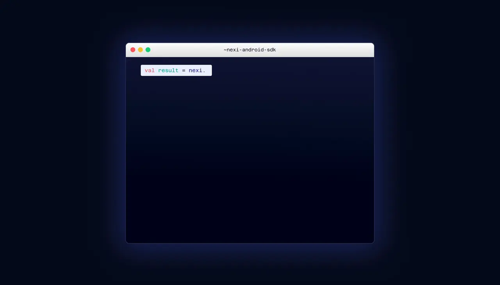

# Nexi Android SDK

Bring Nexi payments straight into your Android app. 🎉✨



The Nexi Android SDK brings your app and the Nexi EP2 payment application together in one seamless payment experience. Its modern Kotlin API makes it easy to start transactions, work with receipts, and manage the terminal without leaving your app. It simplifies integrating your ECR app with Nexi Switzerland.

## Quick start

First, [add the SDK to your application](integration.md#add-the-sdk-to-an-application). Then create an instance with the default settings and take your first payment:

```kotlin
val nexiSdk = NexiAndroidSdk.create(context)

suspend fun takePayment() {
    val result = nexiSdk.payment(
        amount = 1250,
        currency = "CHF"
    )

    when (result.status) {
        ResultState.SUCCESS -> showSuccess(result)
        ResultState.DECLINED -> showDecline(result.errorCode)
        else -> showPaymentError(result)
    }
}
```

Amounts use the currency's minor unit, so `1250` represents CHF 12.50.

## What the SDK provides

- Take payments, issue refunds, and reverse transactions through a clean Kotlin API.
- Run terminal operations and retrieve terminal information directly from your app.
- Handle every outcome with typed results and structured errors.
- Print merchant and customer receipts or return them to your app for display and storage.
- Offer Dynamic Currency Conversion (DCC) and receive the complete result details.
- Use the payment experience in English, German, French, or Italian.
- Configure timeouts, receipt handling, and Force Acceptance to match your integration.
- Bring your app back to the foreground automatically when an operation is complete.
- Diagnose integration issues with optional, redacted file logging.

## Documentation

- [Integration guide](integration.md)
- [Kotlin SDK API reference](https://richiehug.github.io/nexi-android-sdk/)

The API reference is generated directly from the SDK's KDoc for every public release and documents all public methods, request and response models, result states, errors, configuration options, and events.

## Requirements

- Android 8.0 / API 26 or newer
- Kotlin application with coroutine support
- Java 17 to build the project
- A provisioned Nexi payment application reachable from the Android device, either locally or through the terminal's network address

## License

The SDK is distributed under the proprietary [Nexi Android SDK License](LICENSE).
You may use and bundle the SDK in commercial POS/ECR applications. Standalone
redistribution, resale, republishing, sublicensing, and repackaging are not
permitted. The SDK source code is not distributed.

## Support

For help, questions, or bug reports, [open an issue on GitHub](https://github.com/richiehug/nexi-android-sdk/issues).
